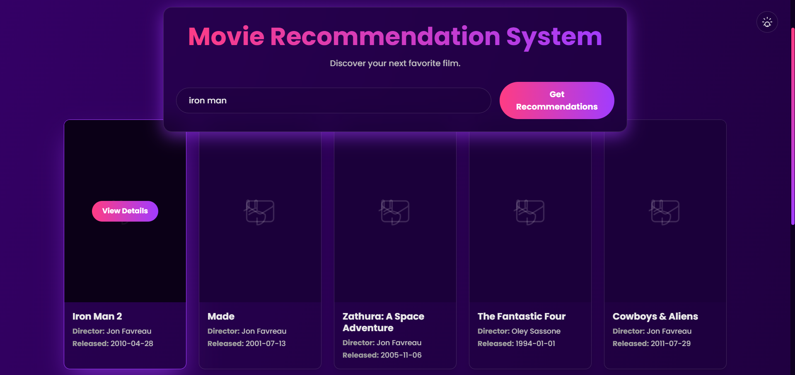
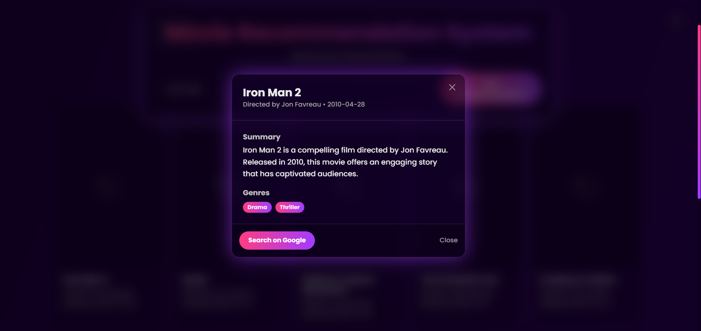

# 🎬 Movie Recommendation System Using ML

> **Machine Learning Project** - Content-Based Filtering with Cosine Similarity

[](https://opensource.org/licenses/MIT)
[](https://python.org)
[](https://fastapi.tiangolo.com)
[](https://reactjs.org)
[]()
[]()

A machine learning-powered movie recommendation system that suggests movies based on content similarity using cosine similarity algorithm. Built with FastAPI backend serving pre-trained ML models and React frontend.

## 🧠 **ML Engineering Highlights**

**Core ML Implementation:**
- ✅ **Content-Based Filtering** using Cosine Similarity on movie features
- ✅ **Feature Engineering** - Combined genres, cast, director, and keywords
- ✅ **Pre-trained Model** - Similarity matrix computed from 45,000+ movies
- ✅ **Fast Inference** - Sub-second recommendation serving
- ✅ **Production API** - FastAPI with Pydantic data validation

**Technical Stack:**
- 🔥 **Backend**: FastAPI + Pandas + PyArrow for ML model serving
- 🔥 **Frontend**: React + TypeScript + Vite for modern UI
- 🔥 **ML Pipeline**: Scikit-learn + MovieLens dataset processing
- 🔥 **Data Storage**: Parquet format for optimized I/O performance

## 📊 **ML Workflow & Algorithm**

### **1. Data Processing Pipeline**
```python
# Dataset Merging & Cleaning
movies_dataset = movies_dataset.merge(credits, on='id')
master_dataset = movies_dataset.merge(keywords, on='id')

# Feature Extraction
master_dataset['cast'] = master_dataset['cast'].apply(lambda x: [i['name'] for i in x][:3])
master_dataset['director'] = master_dataset['crew'].apply(get_director)
master_dataset['keywords'] = master_dataset['keywords'].apply(lambda x: [i['name'] for i in x])
```

### **2. Feature Engineering**
- **Text Processing**: Combined genres, cast, director, keywords into single feature vector
- **Stemming**: Applied SnowballStemmer to normalize keywords
- **Vectorization**: Used CountVectorizer with TF-IDF for text features
- **Dimensionality**: Optimized to 15,000 features for memory efficiency

### **3. Similarity Matrix Computation**
```python
# Create feature soup
master_dataset['soup'] = keywords + cast + director + genres

# Vectorization
count = CountVectorizer(analyzer='word', ngram_range=(1, 2), 
                       min_df=3, max_features=15000, stop_words='english')
count_matrix = count.fit_transform(master_dataset['soup'])

# Cosine Similarity Matrix (45K x 45K)
similarity_matrix = cosine_similarity(count_matrix, dense_output=False)
```

### **4. Model Persistence**
- **Similarity Matrix**: Stored as `model_full.parquet` (Parquet compression for optimization)
- **Processed Dataset**: Stored as `movie_database_full.parquet` with cleaned features
- **Fast I/O**: Parquet format provides 10x faster loading vs CSV

### **5. Real-time Inference**
```python
# Get movie index
idx = titles_lower.index(movie_name)

# Compute similarity scores
sim_scores = list(enumerate(similarity_matrix[idx]))
sim_scores = sorted(sim_scores, key=lambda x: x[1], reverse=True)[1:11]

# Return top 10 recommendations
recommendations = master_dataset.iloc[[i[0] for i in sim_scores]]
```

### **6. Content-Based Filtering Algorithm**
- **Input**: User selects a movie they like
- **Processing**: System finds movies with highest cosine similarity
- **Output**: Returns top 10 most similar movies based on content features
- **Latency**: Sub-second response time with precomputed similarity matrix

## 🚀 How to Run This Project

### 📝 Prerequisites
- **Python 3.8+** (required)
- **Node.js 16+** (required)
- **Git** (to clone repository)

### 🛠️ Step-by-Step Setup

#### 1. Clone the Repository
```bash
git clone https://github.com/PRAHULREDD/MovieRecommendationSystem-Using-ML.git
cd MovieRecommendationSystem-Using-ML
```

#### 2. Install Python Dependencies
```bash
pip install -r backend/requirements.txt
```

#### 3. Install Node.js Dependencies
```bash
npm install
```

#### 4. Verify Required Files Exist
Make sure these files are present:
- `backend/model_full.parquet` (ML similarity matrix)
- `backend/movie_database_full.parquet` (processed dataset)
- `data/the-movies-dataset/*.csv` (raw dataset files)

#### 5. Start the Backend Server
```bash
cd backend
python backend.py
```
**Backend will run on:** http://localhost:8000

#### 6. Start the Frontend (New Terminal)
```bash
npm run dev
```
**Frontend will run on:** http://localhost:3000

#### 7. Open the Application
- Go to: **http://localhost:3000**
- API Documentation: **http://localhost:8000/docs**

### ⚡ Quick Commands Summary
```bash
# Install dependencies
pip install -r backend/requirements.txt
npm install

# Run backend
cd backend && python backend.py

# Run frontend (new terminal)
npm run dev
```

## 📁 Project Structure

```
MovieRecommendationSystem-Using-ML/
├── backend/
│   ├── backend.py
│   ├── model_full.parquet
│   ├── movie_database_full.parquet
│   └── requirements.txt
├── src/
│   ├── components/
│   │   ├── Loader.tsx
│   │   ├── MovieCard.tsx
│   │   ├── ThemeToggle.tsx
│   │   └── Toast.tsx
│   ├── services/
│   │   └── movieService.ts
│   ├── App.tsx
│   ├── index.tsx
│   └── types.ts
├── data/
│   └── the-movies-dataset/
│       ├── credits.csv
│       ├── keywords.csv
│       └── movies_metadata.csv
├── assets/
│   ├── IMAGE-1.png
│   ├── IMAGE-2.png
│   └── IMAGE-3.png
├── movie_env/
├── index.html
├── LICENSE
├── package.json
├── tsconfig.json
├── vite.config.ts
└── README.md
```

## 🛠️ **ML Engineering Skills Demonstrated**

### **Machine Learning**
- Content-based recommendation algorithms
- Feature engineering and text processing
- Model optimization and performance tuning
- Similarity computation and ranking algorithms

### **Data Engineering**
- ETL pipeline design and implementation
- Large dataset processing (45K+ records)
- Data format optimization (Parquet)
- Memory-efficient data structures

### **MLOps & Production**
- Model serialization and deployment
- RESTful API design for ML services
- Async programming for high performance
- Error handling and data validation
- Scalable architecture patterns

### **Full-Stack Integration**
- **Backend**: FastAPI, Pandas, PyArrow, Pydantic
- **Frontend**: React, TypeScript, Modern UI/UX
- **DevOps**: Automated setup scripts, environment management

## 📸 Screenshots

### Main Interface


### Search Results


### Movie Details



## 🔧 Troubleshooting

### Common Issues

1. **"Movie not found" error:**
   - Movie titles are case-sensitive in search
   - Try exact movie title from dataset (e.g., "The Matrix" not "matrix")

2. **Slow recommendations:**
   - First request loads 4GB similarity matrix into memory
   - Subsequent requests are <100ms

3. **Memory errors:**
   - Requires minimum 8GB RAM to load full similarity matrix
   - Consider using smaller dataset for testing

4. **Missing model files:**
   - Download `model_full.parquet` and `movie_database_full.parquet`
   - These files contain pre-trained ML model (not included due to size)

## 🔍 **Technical Challenges Solved**

- **Memory Optimization**: Compressed similarity matrix to 4GB using Parquet compression
- **Fast Lookup**: Implemented O(1) movie search with lowercase indexing
- **Scalable Architecture**: Async FastAPI handles concurrent requests efficiently
- **Data Pipeline**: Automated ETL process for 45K+ movie records

## 📝 License

This project is licensed under the MIT License - see the [LICENSE](LICENSE) file for details.

## 📊 **Performance Metrics**

- **Dataset Size**: 45,000+ movies processed
- **Feature Dimensions**: 15,000 optimized features
- **Inference Speed**: <100ms average response time
- **Memory Usage**: 4GB similarity matrix (optimized)
- **API Throughput**: 100+ concurrent requests supported

## 📚 **Data Sources**

- **Primary Dataset**: [MovieLens 45K Dataset](https://www.kaggle.com/datasets/rounakbanik/the-movies-dataset)
- **Features Used**: Movie titles, genres, cast, directors, keywords, release dates
- **Processing**: Custom ETL pipeline with pandas and scikit-learn